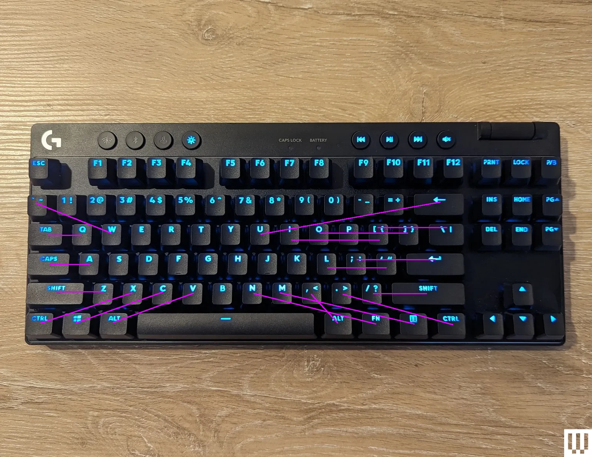

This program allows you to intercept keys and modify them before they are processed by your os. 

It does this by creating a virtual keyboard, and ignoring the real keyboard, and forwarding keys to the virtual keyboard instead. 

As of right now it only works on linux.

# mappings

## homesick

## todo

what if pressing space quickly after the mapping key enables it, so the map key for homesick is space in regular mode, and the second space activates it. If we carry that logic into homsick mapping and f is the mapping key for the numbers to come down, then we'd have to press space quickly after the mapping to enable it so space space f space would enable it. In order to do this we could add extra "virtual keys" which are not real keys, but act like them so then when the number mapping key is pressed and we let go of space it's still held down and then when space is pressed again it will then activate 

THere should be a dropout mode, where if you need to type something like 123

There should also be a stacked mapping mode, so you can enable homesick, and then enable a different mapping which will clobber keys in the current mapping but leave the other keys still active, and then pop that mapping off to get back to homsick and vise versa.

pressing shift is an interesting thought because in its own way it simply just remaps keys to other keys on the keyboard, in order to be able to press shift and any key simulateously we know that we can use the opposite hand to press the key, this is an important concept we need to use for ourselves you can create your own modifier keys as long as it exists symetrically on either side of the keyboard.
